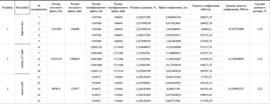

# Files encrypting at the bit level using RSA algorithm

Using high-level Python code (strigns), with simple and beautiful web application

Высокоуровневый Python (работа со строками), а также простой и красивый веб-интерфейс. Проект выполнен в рамках практической работы по предмету Информационная Безопасность, где постановка задачи подразумевает использование высокоуровневого ЯП.
## Features

- Secure RSA files encrypting with public and private keys
- Low difference between the size of the original and encrypted files (~1.22%)
- Web application

## Installation

To start web application on localhost:5000 run

```bash
  python3 main.py
```

## Encrypting algorithm

1) Generate a random number N, consisting of 49 decimal places;
2) Generate numbers P and Q, get public and private keys;
3) Read the file to blocks of N_bits * 8 bytes, where N_bits is the number of bits in the number N;
4) From the block of bits we take N_bits bits, get a numerical representation of this slice, compare it with N. There are 2 options here:
- Numerical representation of a slice less than N: we add two bits (markers) to the slice: 00, which means: the slice remained unchanged.
- Numerical representation of a slice greater than N:
  - add bit 0 to the beginning of the slice;
  - remember and cut off the last bit of the cut;
  - add two bits (markers) to the slice: 1 (the slice was changed) and the last bit of the slice;
5) We encrypt the numeric representation of the resulting slice using the RSA algorithm, convert it back into bits and return it. The output is a string of bits, exactly 2 bits larger than the original;
6) Repeat steps 4-5 k / N_bits times, where k is the length of the read block.
7) Repeat steps 3-6 until we reach the end of the file.
8) At the beginning of the slice containing the last bits of the file, if its length is < N_bits, add n bits 0, where n = N_bits – len (slice). At the end of the slice we add a bit representation of the number n (the number of zeros added to the slice). If length = N_bits, add the bit representation of the number 0 to the slice.

#

1)	Генерируем случайное число N, состоящее из 49 десятичных знаков;
2)	Генерируем числа P и Q, получаем открытый и закрытый ключи;
3)	Читаем файл блоками по N_bits * 8 байт, где N_bits – количество бит в числе N;
4)	Из считанного блока бит берем N_bits бит, получаем числовое представление данного среза, сравниваем с N. Здесь возможны 2 варианта:
- Числовое представление среза меньше N: добавляем к срезу два бита (маркеры): 00, что означает: срез остался без изменений.
- Числовое представление среза больше N:
  - добавляем в начало среза бит 0;
  - запоминаем и отрезаем последний бит среза;
  - добавляем к срезу два бита (маркеры): 1 (срез был изменен) и последний бит среза;
5)	Шифруем числовое представление полученного среза, используя алгоритм RSA, конвертируем обратно в биты и возвращаем. На выходе получаем строку бит, ровно на 2 бита большую, чем исходная;
6)	Повторяем шаги 4-5 k / N_bits раз, где k – длина считанного блока. 
7)	Повторяем шаги 3-6 пока не дойдем до конца файла.
8)	В начало среза, содержащего последние биты файла, если его длина < N_bits, добавляем n битов 0, где n = N_bits – len(срез). В конец среза добавляем битовое представление числа n (количество добавленных к срезу нулей). Если длина = N_bits, добавляем к срезу битовое представление числа 0.


## Decrypting algorithm

1) Get the number N from the key;
2) Read the file to blocks of (N_bits + 2) * 8 bytes, where N_bits is the number of bits in the number N;
3) From the block of bits we take N_bits + 2 bits, the outer 2 bits are markers.
4) If the marker is 00, we take the numerical representation of the slice without markers. If the marker starts with 1, then we cut off the first bit 0 from the slice, and add the value of the second marker to the slice.
5) We take the numerical representation of the resulting slice, decrypt it using the RSA algorithm, convert it back into bits and return it.
6) Repeat steps 3-5 (k – 8) / N_bits + 2 times, where k is the length of the read block;
7) Repeat steps 2-6 until we reach the end of the file.
8) We read the outer 8 bits of the slice containing the last bits of the file, we get the number n (the number of 0 bits added to the last slice). We cut off n zeros from the slice and return the resulting slice minus the last byte.

#

1)	Получаем число N из ключа;
2)	Читаем файл блоками по (N_bits + 2) * 8 байт, где N_bits – количество бит в числе N;
3)	Из считанного блока бит берем N_bits + 2 бит, крайние 2 бит – маркеры.
4)	Если маркер 00 – берем числовое представление среза без маркеров. Если маркер начинается с 1, то отрезаем у среза первый бит 0, к срезу прибавляем значение второго маркера.
5)	Берем числовое представление полученного среза, расшифровываем его, используя алгоритм RSA, конвертируем обратно в биты и возвращаем.
6)	Повторяем шаги 3-5 (k – 8) / N_bits + 2 раз, где k – длина считанного блока;
7)	Повторяем шаги 2-6 пока не дойдем до конца файла.
8)	Считываем крайние 8 бит среза, содержащего последние биты файла, получаем число n (число битов 0, добавленных к последнему срезу). Отрезаем от среза n нулей, возвращаем полученный срез за вычетом последнего байта.

## Performance tests

 "Performance tests"

## Authors

- [@arud3nko](https://www.github.com/arud3nko)


## License

[MIT](https://choosealicense.com/licenses/mit/)

